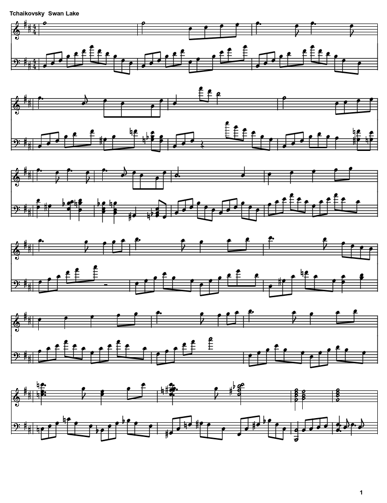

# MidiToSheetMusic

MidiToSheetMusic is a very simple tool used for conversion from MIDI file to
sheet music. It is forked and simplified from the original project
[Midi Sheet Music](https://midisheetmusic.sourceforge.net/), reduced to a single
command line program with the GUI and playback parts removed. MidiToSheetMusic
is written in C# and builds on .NET 8.

## Build

Have the [.NET SDK](https://dotnet.microsoft.com/download) 8.0 or later
installed, then:

    make            # build into bin/
    make run        # build, then convert songs/sample.mid
    make clean      # remove build output

``make`` is a thin wrapper around ``dotnet publish -c Release -o bin``.

### Native GDI+ dependency

The drawing code uses ``System.Drawing``, which needs the native ``libgdiplus``
library on macOS and Linux. Install it before building:

    brew install mono-libgdiplus      # macOS
    sudo apt-get install libgdiplus   # Debian/Ubuntu

On macOS the build stages a copy of the library into
``bin/runtimes/unix/lib/net6.0/``, where ``System.Drawing`` looks for it, since
Homebrew's lib directory is not on the default search path. On Linux the package
installs into a standard loader path and is found directly. Either way no
``LD_LIBRARY_PATH`` or ``DYLD_LIBRARY_PATH`` is needed at run time.

``System.Drawing.Common`` is pinned to 6.0.0 and the
``System.Drawing.EnableUnixSupport`` switch is set in
``runtimeconfig.template.json``. Later versions are Windows-only and throw
``PlatformNotSupportedException`` elsewhere. That switch is a compatibility shim
Microsoft no longer supports, so it may stop working in a future runtime;
porting the drawing code to a cross-platform library such as SkiaSharp would
remove the constraint.

## Usage

Run ``dotnet bin/sheet.dll`` in command line, then you will see:

    Usage: sheet input.mid output_prefix(_[page_number].png)

For example I would like to convert songs/sample.mid to sheet music, simply run:

    dotnet bin/sheet.dll songs/sample.mid sample

Then you will find ``sample_1.png`` generated. A MIDI file that does not fit on
one page produces ``sample_1.png``, ``sample_2.png`` and so on.

``bin/sheet`` is a native launcher for the same program. It only works when the
.NET runtime lives in a standard location, so prefer the ``dotnet`` form above
if your SDK is installed elsewhere.

## Screenshot

The first page of ``songs/Tchaikovsky__Swan_Lake.mid``:

## License

GNU General Public License version 2, with an exemption for the Microsoft .NET
framework. See [LICENSE.txt](LICENSE.txt) for the full text.
